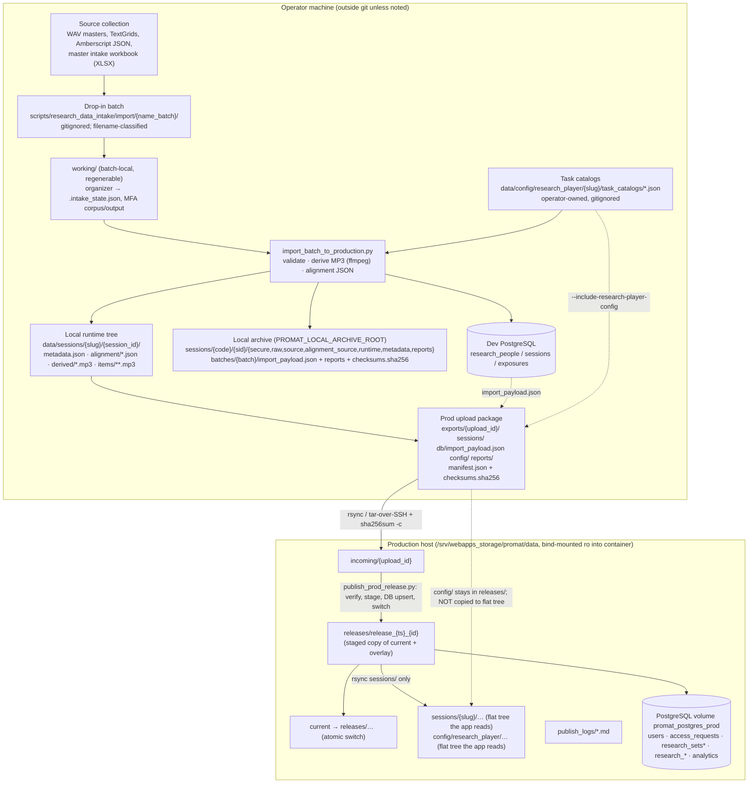
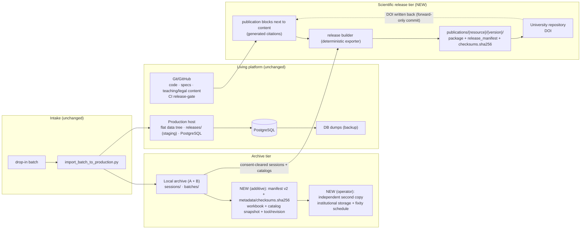

# Pronunciation Matters — Storage, Preservation & Scientific Release Architecture

## Status

Planning input (2026-10-05). **Not normative.** Active rules stay in `docs/spec/`; nothing here changes behaviour. When a proposal is adopted it moves into the relevant spec file and this plan receives a status note (see `docs/AGENTS.md`).

Status note (2026-10-05): the fixity, provenance and verified-copy parts of this plan (G1–G4, preservation states, cleanup-eligibility report) are implemented in `scripts/research_data_intake/{fixity,provenance,preservation,archive_preservation}.py` and specified in `docs/spec/platform-data-files.md` ("Archive provenance and fixity", "Institutional preservation"); the spec and `docs/runbooks/archive-preservation.md` win over this plan. The release lifecycle, German readiness, DOI export and consent-withdrawal parts remain open proposals.

Basis: branch `claude/production-safety-foundation` (the Production Safety Foundation, not yet merged into `main` when this plan was written), audit `docs/audits/promat_reentry_audit_2026-10-04.md`, run report `docs/agent-runs/2026-10-04_production-safety-foundation.md`, the specs, the intake/backup/deploy runbooks, `docs/plans/prep_prod/*`, and the code under `scripts/research_data_intake/`.

Evidence markers used below:

- **[F]** fact, verified in a repository file (path given or obvious)
- **[I]** inference from repository evidence
- **[U]** unknown; needs operator verification or an institutional decision

Decision labels: **KEEP** (appropriate as is), **HARDEN** (same behaviour, stronger validation/reproducibility/integrity/documentation), **EXTEND** (new capability, nothing replaced), **CHANGE** (replace existing behaviour; requires evidenced defect). This plan proposes **no CHANGE**.

No production system, server, or scientific file was accessed. The environment cannot reach `pronunciation-matters.de`.

---

## 1. Executive decision

| Question | Answer |
|---|---|
| Is the current storage architecture fundamentally usable? | **Yes.** Filesystem + PostgreSQL + `sha256` manifests + a session-centred local archive is proportionate for this project and already encodes the right separations (`secure/` vs runtime, archive vs runtime, working vs data, staged releases with an atomic switch). No new infrastructure is needed. |
| Does intake need redesign? | **No.** Every intake stage works and has a record of real batches (Spanish, French, English). **KEEP AS IS**; only additive provenance hardening is proposed (§6). |
| Can the existing intake stay canonical? | **Yes**, including source formats, canonical filenames, server paths, SSH transfer, staging, checksums, atomic switch, DB integration and import order. |
| What must happen before the German research intake? | Only four things (§7): (1) the operator compares the local original of `organize_batch_working_tree.py` with the committed reconstruction; (2) German **task catalogs** (`wordlist.json`, `text.json`) exist under `data/config/research_player/german/task_catalogs/` and pass the validator; (3) the German batch, workbook rows and filenames follow the existing conventions; (4) one single-speaker dry run in isolated roots passes. No storage or preservation change is required before intake. |
| What can safely wait? | Everything in §8–§11 (release lifecycle, publication metadata, exporters), the archive provenance hardening (it should land before the *second* German batch, ideally before the first), UI label polish, `player_config.json` cleanup. |
| Main preservation gaps | (a) the archive manifest is incomplete as provenance (no original filenames, no workbook, no tool/catalog/code versions) and archive files have no standard checksum file; (b) no independent second copy and no fixity schedule for the only copy of the original recordings, and the default backup location shares the data's storage tree **[I]**; (c) task catalogs are mutable, unversioned and operator-local although sets, alignments and exports reference their stable item IDs; (d) there is no release concept — the server's `releases/` are deployment staging with short retention; (e) research-design/teaching citations are hard-coded strings pointing at the living URL, without version or license; (f) consent-withdrawal handling across archive, server, DB, releases and published snapshots is undefined. |

**Biggest single risk [F+I]:** the archive under `PROMAT_LOCAL_ARCHIVE_ROOT` holds the only copy of the original recordings (the server keeps only lossy, loudness-normalised MP3 derivatives), and nothing in the repository describes a second copy. This is an operator action, not a code change, and it does not block German intake — but it should not wait for the preservation run.

---

## 2. Current-state data lifecycle

### 2.1 Pipeline (facts)



Facts behind the diagram:

- Source formats and classification: WAV/TextGrid/JSON/XLSX, classified strictly from filenames; ambiguity is reported, never guessed [F: `intake_batch_common.py`, `docs/spec/platform-data-files.md` “Intake Batch Working Filesystem”].
- The workbook is **not** copied into the archive; only `secure/secure_person_intake.json` (the 16 `Secure_Person_Intake` columns) and the normalised `runtime/metadata.json` per session are [F: `import_batch_to_production.py` has no workbook copy; `intake_storage.write_secure_person_export`, `write_session_archive`].
- Archive input files are stored under canonical names (`raw/{task}.wav`, `source/{task}.wav`, `alignment_source/{task}.{TextGrid,json}`); the original filename is not recorded in the manifest [F: `_archive_target_relative`, `_file_manifest_entry`].
- `importer_version` is the constant string `"import_batch_to_production"`, not a revision [F: `import_batch_to_production.py:1410`].
- Publish stages a full copy of `current`, overlays `incoming`, re-checks checksums, switches `current`, then `rm -rf` + `rsync` of `sessions/{corpus}` into the flat tree; `config/` is never copied to the flat tree [F: `publish_prod_release.py`, no occurrence of `config`]. The 2026-06-19 French `théâtre` incident (flat config differed from the release) is the real-world consequence [F: `docs/agent-runs/2026-06-19_french-theatre-live-production-fix.md`].
- Release retention keeps the current release plus one previous release ≤ 7 days [F: publish script defaults/rollback hint].
- `player_config.json` has **no production caller**: `load_player_config` is used only by tests and the new validator [F: grep of `app/src`]. The app reads the task catalogs only.

### 2.2 Where facts end and inference begins

| Topic | Status |
|---|---|
| Server directory contents beyond `incoming`, `releases`, `current`, `sessions`, `publish_logs`, `quarantine`, `backups`, `config` | **[U]** known from run logs and plans, never verified by SSH here (`prep_server.md` itself says so) |
| Whether the archive has any second copy, and where `PROMAT_LOCAL_ARCHIVE_ROOT` really points | **[U]** |
| Whether the master workbook is versioned or backed up | **[U]** |
| `docs/plans/prep_prod/prep_intake.md` describes `production/{sessions/es,…}`; reality is flat `sessions/{slug}` + `releases/` + `current` | **[F]** plan superseded by implementation; the plan lacks a status note |
| Real content of `person_notes` in production | **[U]** |

---

## 3. Current storage inventory

| # | File class | Location | In git | Mutability | Backup today | Regenerable |
|---|---|---|---|---|---|---|
| 1 | Original WAV masters (`raw`) | batch dir → archive `raw/{task}.wav` | no | immutable by convention | none documented **[U]** | no |
| 2 | Processed/source WAV (`source`) | batch dir → archive `source/{task}.wav` | no | immutable by convention | none documented **[U]** | no (operator-processed) |
| 3 | Alignment sources (TextGrid, Amberscript JSON, MFA exports) | batch dir → archive `alignment_source/` | no | immutable | none documented **[U]** | no (manual annotation) |
| 4 | Master intake workbook (XLSX) | operator machine, batch dirs | no | edited over time | none documented **[U]** | no |
| 5 | Secure person data (`secure_person_intake.json`, consent/questionnaire PDFs) | archive `secure/` | no | append | none documented **[U]** | no |
| 6 | Batch working tree (`working/`, `.intake_state.json`, `mfa_*`) | batch dir | no | temporary | none (not needed) | yes |
| 7 | MFA model cache | `scripts/research_data_intake/.mfa_cache/` | no (ignored) | cache | none (not needed) | yes (download) |
| 8 | Task catalogs, `player_config.json`, legacy `phenomena_presets.json` | `data/config/research_player/{slug}/` local and server flat tree | **no** | edited by hand | file copy recommended in `backup-and-restore.md`; not scheduled | no (scholarly content) |
| 9 | Runtime session artifacts (`metadata.json`, `alignment/*.json`, `derived/*.mp3`, `items/**.mp3`) | local `data/sessions/…`; server flat `sessions/…` and `releases/…` | no | replaced by import/publish | server: none; derived copy also in archive `runtime/` | yes (from batch + catalogs + code) |
| 10 | Archive runtime mirror, `archive_manifest.json`, `import_report.json` | archive `runtime/`, `metadata/`, `reports/` | no | rewritten per re-import | none documented **[U]** | partly (mirror is a copy) |
| 11 | Batch archive reports (`import_payload.json`, 3 md reports, `checksums.sha256`) | archive `batches/{batch}/` | no | overwritten per run (a `--person-id` run shrinks the payload) | none documented **[U]** | yes (re-run) |
| 12 | Prod upload package | `scripts/research_data_intake/exports/{id}/` | no (ignored) | refuses overwrite | none (derived) | yes |
| 13 | Server staging and history | `incoming/`, `releases/`, `current`, `publish_logs/`, `quarantine/` | no | deploy-managed | none; 1 previous release ≤ 7 days | yes (except logs) |
| 14 | PostgreSQL (13 tables) | volume `promat_postgres_prod` | no | live | `scripts/backup_prod_db.sh` (verified restore) | accounts/sets/requests no; `research_*` partly re-importable |
| 15 | Redis (rate limiting) | volume `promat_redis_prod` | no | ephemeral | not needed | yes |
| 16 | Teaching content and media | `content/teaching/**` (YAML, mp3, svg) | **yes** | commits | git + GitHub | yes (it *is* the source) |
| 17 | Legal, project and design-page content | `content/legal/`; **Python dicts** in `routes/public_page_content_data.py` | yes | commits | git | yes |
| 18 | Secrets / env file | `/srv/webapps/promat/config/passwords.env` | no | manual | operator, separate from dumps (documented) **[U]** | no |
| 19 | Logs | `/srv/webapps/promat/logs`, container stdout, `publish_logs/`, GoatCounter (external), analytics tables (daily aggregates) | no | rotating | none | no (non-critical, except publish logs as provenance) |
| 20 | DB dumps | `/srv/webapps_storage/promat/backups/postgres` | no | rotated (`--keep 14`) | default path in the same storage tree as the data **[I]** | n/a |
| 21 | nginx/TLS config | host only | **no** | manual | none **[U]** | no |
| 22 | Code, specs, CI | GitHub | yes | commits | GitHub | yes |

Observations: classes 1–5, 8 and 21 are irreplaceable and have no documented independent copy; class 9 is regenerable but no script performs “restore runtime from archive”; the DB holds the application copy of canonical person/session metadata (class 14) next to pure application state.

---

## 4. Proposed storage-class model

The A–E model **fits**, with two refinements: (1) class A has a *restricted* sub-class (secure/identifying data); (2) three kinds of *context* needed to interpret or reproduce B and C (task catalogs, tool versions, code revision) must be treated as part of B rather than as configuration.

| | A. Original / source | B. Canonical research data | C. Derived application assets | D. Operational state | E. Publication / preservation |
|---|---|---|---|---|---|
| Contents | WAV masters (`raw`), processed WAVs (`source`), TextGrids / Amberscript JSON (`alignment_source`), master workbook, consent/questionnaire PDFs (restricted `secure/`) | per-session normalised `metadata`, task/item assignments, **task catalogs** (+ their version), final alignment JSON, the archive manifests | web MP3 (160 kbit/s mono, loudnorm), item clips, `alignment/*.json` served, packages, `releases/`, caches, indexes | PostgreSQL (accounts, reset tokens, access requests, sets, analytics), Redis, logs | corpus releases, research-design and teaching releases, metadata packages, DOI deposit packages |
| Source of truth | itself | archive session tree + catalogs (today: archive `runtime/metadata.json` + workbook; DB and server copies are *copies*) | derived from A+B+code | the database | the release package once built |
| Mutability | immutable (never rewritten) | append/versioned; corrections are explicit events (`wl_014` precedent) | freely replaceable | live | immutable |
| Canonical location | archive `raw/ source/ alignment_source/ secure/` + master workbook | archive `metadata/ runtime/` + `data/config/research_player/` | server flat tree, local runtime tree, exports | server DB volume | `PROMAT_PUBLICATION_ROOT` proposed (§16) + university repository |
| Backup | independent copies; restricted copy for `secure/` | independent copies | not needed | nightly dump + off-server copy | n/a (the deposit is the preserved copy) |
| Preservation | **yes, priority 1** | **yes** | no | no (export only what a release needs) | **yes** |
| Checksums | sha256 at ingest; fixity re-check on schedule | sha256 + catalog hash | `checksums.sha256` per package (exists) | n/a | `checksums.sha256` + release manifest |
| Versioning | by session id; re-import history in manifests | session `metadata` revisions; catalog versions | by publish release (short-lived) | schema migrations | explicit semantic versions |
| Restore | copy back from independent copy | copy back; DB `research_*` from payload/mirror | regenerate or restore from archive `runtime/` mirror | `restore_db_dump.sh` | re-deposit not needed |
| Regeneration | impossible | impossible (catalogs/metadata) | yes | no | by exporter from tag |
| Deletion/retention | consent-driven; **[U]** institutional rule | follows A | any time | accounts/requests: policy **[U]** | persistent by design; withdrawal needs tombstone policy **[U]** |

Rule of thumb for new work: *if you cannot recreate it from A + B + code, it belongs to A or B and needs an independent copy.*

---

## 5. Backup versus preservation

| Mechanism | Exists | Role today | Preservation? |
|---|---|---|---|
| `scripts/backup_prod_db.sh` (+ verify/restore) | yes | operational backup of class D (disaster recovery) | **No** — rotated (`--keep 14`), default location in the same storage tree as the data **[I]**, no provenance |
| Server `releases/` with 1 previous ≤ 7 days | yes | deployment rollback aid | **No** |
| `publish_logs/*.md` | yes | audit trail of publish events | provenance fragment only |
| Local archive `PROMAT_LOCAL_ARCHIVE_ROOT` | yes | the **primary copy** of A and B; designed as the “complete long-term research archive” (`prep_intake.md`) | **Not yet**: single location **[U]**, no fixity schedule, manifest incomplete |
| Git/GitHub | yes | version history of code, specs, teaching/legal content | partial: versioned but mutable, not DOI-citable, not an archive of research data |
| Teaching/design pages | yes | living pages | no snapshot exists |
| University repository deposit | **not yet** | — | the intended preservation layer for class E |

Definitions to adopt: **backup** = a recent, replaceable copy for recovery, restored in minutes to hours, discarded by rotation; **preservation** = independent, fixity-checked, documented, immutable, citable copies with provenance, kept by policy. The existing archive becomes the preservation *source* once it has (a) an independent second copy, (b) fixity checking, (c) a complete provenance manifest. Calling the DB dump or the server data directory “the archive” would be wrong.

---

## 6. Integrity, checksum and manifest model

### 6.1 What exists (KEEP)

| Artifact | Content | Verdict |
|---|---|---|
| `checksums.sha256` in packages and batch archive reports | `sha256sum -c` format, LF-only, UTF-8, validated by `validate_prod_package`; verified locally, remotely after upload and again on the server at publish | **KEEP** — the single integrity convention |
| Package `manifest.json` | `upload_id`, `built_at`, `sessions`, `files` (paths only) | **KEEP** (hashes live in `checksums.sha256`; do not duplicate) |
| Archive `metadata/archive_manifest.json` | per input/runtime file: `path`, `role`, `sha256`, `size`; `task_audio_roles`; warnings; skipped artifacts | **KEEP + HARDEN** (below) |
| Publish log | status of each gate | **KEEP** |

### 6.2 Gaps (evidence) and smallest additive fixes

| Gap | Evidence | Why insufficient | Smallest safe change | Compatibility | Rollback |
|---|---|---|---|---|---|
| G1 original filename and batch-relative path not recorded | `_file_manifest_entry` has no such field; archive uses canonical names | provenance of a recording (“which delivered file is this?”) is lost once the batch dir is cleaned | add `original_filename`, `source_relative_path` (from `ParsedBatchFile.relative_source`) to each input entry | additive JSON keys; readers ignore unknown keys; validators do not check them | revert code; old manifests stay valid |
| G2 workbook not archived or hashed | no copy anywhere | the metadata source of truth cannot be reconstructed after the master workbook changes | at import copy the **batch workbook** to `batches/{batch}/` and record its sha256 (secure content stays in archive `secure/`; the workbook contains identifying sheets, so it is archive-only, never packaged) | new file in archive batch dir; nothing reads it today | delete the file; no dependency |
| G3 catalogs not hashed/snapshotted | catalogs are read from `data/config` at run time | “which wordlist text was used for this alignment” is unanswerable after a catalog correction (`wl_014`) | record `catalog_sha256` per task in the manifest and keep a snapshot of the catalogs used under `batches/{batch}/catalogs/` | additive | same |
| G4 `importer_version` is a constant string | line 1410 | cannot tie derived output to code | record git revision (or `unknown` outside git), `ffmpeg -version` first line, MFA version where run, Python version | additive keys | same |
| G5 archive has no standard checksum file | only JSON manifest | needs custom code to verify; cannot use `sha256sum -c` on an off-site copy | write `metadata/checksums.sha256` (same format as packages; relative paths from the session root) | additive file; `validate_archive_tree` reports any top-level child that is not in `ARCHIVE_SESSION_SUBDIRS`, so the file must live under `metadata/` (`metadata/checksums.sha256`), not at the session root | same |
| G6 no baseline for **existing** archives | archives of Spanish/French/English batches have manifests without the new fields | fixity cannot be checked for old data | read-only “baseline” script: compute and write `metadata/checksums.sha256` (+ `fixity_baseline.json` with date) for sessions lacking it; never modify existing files | writes new files only | delete the new files |
| G7 no fixity re-check | no schedule or tool | silent bit-rot unnoticed on the single copy | `verify_archive` command (`sha256sum -c` per session) run on a schedule against each copy | new tool | none needed |

### 6.3 Release manifest (new, for class E only)

Do not introduce a parallel system for existing data. For scholarly releases (§8) use the same `checksums.sha256` convention plus one `release_manifest.json`:

```json
{
  "schema_version": 1,
  "resource_id": "corpus/german",
  "version": "1.0.0",
  "created": "2026-..-..",
  "generator": {"tool": "promat-release-builder", "revision": "<git sha>"},
  "files": [
    {"path": "data/…", "size": 0, "sha256": "…", "media_type": "audio/mpeg", "role": "derived_audio"}
  ],
  "provenance": {"source_archive_sessions": ["DE-L-0001-2026-S01"], "catalog_sha256": {"wordlist": "…", "text": "…"}}
}
```

Rule: one hash convention (sha256), `checksums.sha256` for verification with standard tools, JSON only for descriptive fields.

---

## 7. German research-data readiness

**Guiding result: the existing intake can accept German after configuration and catalog additions only. No code change is required by evidence.**

### 7.1 Evidence matrix

| Question | Finding | Class |
|---|---|---|
| Is German registered generically? | Yes: `language_config.py` (`de` → `german`, MFA `german_mfa`/`german_mfa`), `config/data_conventions.py` (`TARGET_LANGUAGES`, `STANDARD_VARIETIES["de"]`, slug/code maps), DB check constraint allows `de`, `LANGUAGES` registry entry, `ACTIVE_RESEARCH_CORPORA`, `apply_prod_db_payload.py` mirror [F] | KEEP AS IS |
| Schemas, IDs, filenames | `PERSON_ID_PATTERN` `^[A-Z]{2}-[LN]-\d{4}$` and the batch filename regex accept `DE-…`; session id `{PERSON}-{YYYY}-S{NN}`; workbook vocabularies include target `DE`, standard varieties `DE_STD`, `AT_STD`, `CH_DE_STD` (alias) and `DE_SOUTH_STD`, and a broad `l1_code` list [F] | KEEP AS IS |
| Directory conventions | `data/sessions/german/…`, `sessions/german/…` in packages, archive code `de` [F] | KEEP AS IS |
| Task catalogs | **Do not exist** and are not in git [F]. The importer fails hard without them (`Missing text task catalog`, `load_wordlist_catalog`) | **REQUIRED BEFORE GERMAN INTAKE** (catalog addition) |
| `player_config.json` | no production caller [F]; spec still lists it as canonical | CAN HAPPEN AFTER GERMAN INTAKE (spec cleanup; create only if the owner wants parity) |
| `phenomena_presets.json` | legacy, not loaded (spec) [F] | CAN HAPPEN AFTER |
| MFA | `german_mfa` models are configured; first run downloads models into `.mfa_cache/shared/de/` [F, model availability **[U]**] | covered by the dry run |
| Language-specific code | Spanish defaults only: `--target-language` default `es`, `produce_*_artifacts` default slug; French-only `théatre` correction is scoped to `fr` [F] | KEEP AS IS (always pass `--target-language de`) |
| Text comparison | `_comparison_text` maps typographic apostrophes/quotes/dashes but not German `„ “ ‚ ‘` low-quote forms or `« »`, and performs no Unicode NFC normalisation [F]. French passed the same comparison, so NFC input and consistent quote style are the working assumption [I] | **decided by the dry run**: if a German item mismatches, apply a **HARDEN** (add `„ ‚` to the translate table and NFC-normalise for comparison only) — not before |
| Task availability by speaker type | generic (`is_task_available_for_speaker_type`; native speakers have no interview) [F] | KEEP AS IS |
| Standard-variety labels | all 23 codes incl. the four German ones resolve in de/en [F] | KEEP AS IS |
| Origin-country labels | `ORIGIN_COUNTRY_LABEL_KEYS` knows only Spain and Mexico; other values are “humanised” English text (e.g. “Germany” in the German UI) [F] | CAN HAPPEN AFTER (EXTEND: add Germany/Austria/Switzerland; cosmetic) |
| Validation chain | `validate_runtime_tree`, `validate_archive_tree`, `validate_prod_package`, workbook vocabulary checks are language-agnostic; French has an extra, scoped check [F] | KEEP AS IS |
| German pages | `german` placeholder pages render generically; speakers/comparison/phenomena become productive once data and catalogs exist [F, `research_capabilities.py`] | CAN HAPPEN AFTER |
| Design page | only Spanish exists as content; routing has a Spanish-only branch (audit C3) | CAN HAPPEN AFTER (needed for the German *design page*, not for data) |
| Delivery of German catalogs to the **server** | publish does not copy `config/` to the flat tree [F] | CAN HAPPEN AFTER GERMAN INTAKE, **but before German publication to production** (manual copy + drift check, or the report-only check in run 4) |
| Storage/preservation changes | none required before intake | CAN HAPPEN AFTER (but G1–G4 should precede the *second* batch) |
| Organizer equivalence | unproven (§7.3) | **REQUIRED BEFORE GERMAN INTAKE** (operator comparison) |

### 7.2 Action list

| Action | Class | Label | Owner |
|---|---|---|---|
| Compare the local original organizer with the reconstruction (§7.3) | REQUIRED BEFORE GERMAN INTAKE | HARDEN | operator |
| Create `german/task_catalogs/{wordlist,text}.json` (stable `item_id`s, exact texts, quote style identical to the TextGrid transcription convention) and validate: `validate_research_config.py --runtime-root … --language german` | REQUIRED BEFORE GERMAN INTAKE | EXTEND (catalog addition) | operator / content owner |
| Prepare batch `german_batch_YYYYMMDD` with filenames `de_l_0001_{wordlist|text|interview}_{raw|processed}.{wav|TextGrid|json}` and workbook rows (target `DE`) | REQUIRED BEFORE GERMAN INTAKE | KEEP AS IS | operator |
| Single-speaker dry run (§7.4) | REQUIRED BEFORE GERMAN INTAKE | KEEP AS IS (real pipeline) | operator |
| Ensure the archive root is backed up independently (§13) | before the first *real* German run, because it creates new irreplaceable archive content | operator action | operator |
| `player_config.json` German entry / spec correction | CAN HAPPEN AFTER | HARDEN (docs) | agent |
| NFC/quote hardening in text comparison | only if the dry run needs it | HARDEN | agent |
| Origin-country labels for DE/AT/CH | CAN HAPPEN AFTER | EXTEND | agent |
| German design page, German teaching hub content | CAN HAPPEN AFTER | EXTEND | content owner + agent |
| Config delivery check/copy before German goes live | before German **publication** | HARDEN | operator / agent |

Config additions (none in code): nothing to register — the corpus is already registered. Catalog additions: two JSON files. Code changes: none required by evidence.

### 7.3 Organizer equivalence

**Situation [F].** The original `import/organize_batch_working_tree.py` was never committed. The committed file was reconstructed from tests, runbooks and run logs and is itself marked as such. It must be treated as a *candidate*, not as the reference. The reference is the operator's local file.

**Evidence that supports equivalence [F].**

1. The 37 tests of `test_research_working_tree_intake.py` (13 of them call the organizer directly) plus the importer and raw-sync tests, written against the original, pass on the reconstruction. They pin: bootstrap adoption of an existing working tree, only the interview being rebuilt, idempotency (unchanged mtimes), rebuild on changed JSON, `error_unknown_material_ref_item_id` without aborting the batch, `conflict_multiple_json_candidates`, `conflict_multiple_raw_wav_candidates`, `missing_json`, `not_expected_for_native_speaker` (message text and empty warnings), raw-WAV fallback (`raw_wav_used_as_source`, `selected_inputs.source_wav.stage`), processed-over-raw preference, and a stale-state regression (`_should_rebuild` checks current expected outputs).
2. The state-file schema is pinned by the stale-state test (`version`, `persons.{id}.{task}.{selected_inputs, recognized_sources, last_build_status, last_build_time, last_evaluated_at, outputs}`).
3. Real runs recorded statuses `unchanged`, `rebuilt`, `missing_json`, `missing_wav_and_json`, `rebuilt=0`, `errors=0` (`docs/agent-runs/2026-04-21_*`).
4. The importer consumes only `person_ids` and `summary.errors` from the report [F: `import_batch_to_production.py`], so the report surface that matters operationally is small.

**What the evidence does not establish [U] — compare exactly these.**

| # | Item | Why it is open |
|---|---|---|
| U1 | CLI flags and exit codes | runbooks name `--batch-dir`, `--dry-run`, `--replace-existing`, `--force-task`; `--person-id`, `--transfer-mode`, `--json` and the exit code on task errors are reconstructed |
| U2 | Dry-run output | run log 119: “11 persons, **53 transfers**” (consistent with 4 transfers × 11 persons + 1 interview WAV × 9 learners); the reconstruction reports task statuses but **no transfer count** |
| U3 | Statuses not pinned by tests | `missing_wav`, `missing_textgrid`, `missing_wav_and_textgrid`, `conflict_multiple_processed_wav_candidates`, `conflict_multiple_textgrid_candidates`, `conflict_existing_working_tree`, `planned_rebuild`, `error_interview_transform` are consistent-by-naming inventions |
| U4 | Behaviour with `replace_existing=False` on foreign differing content | the reconstruction invents a conflict status; the importer always passes `True`, so only manual use is affected |
| U5 | Rebuild scope for `text` | the reconstruction removes the whole `working/{id}/text/` (including MFA artefacts) when text inputs changed; whether the original kept `mfa_*` and relied on `mfa_state.json` signatures is not documented |
| U6 | `transfer_mode` `move`/`symlink` | semantics after a move on later runs |
| U7 | Warning texts and ordering, report keys beyond `tasks/summary/person_ids/warnings` | only partly pinned |
| U8 | Handling of files outside the pinned patterns (e.g. tasks with `origin` WAV only) | “no origin fallback” is from a run log |

**Comparison protocol (operator, before the next real intake).**

1. *Static:* `diff` the two files; list every function in the original not present in the reconstruction and every status string (`grep -o "status[^,)]*"`); tick U1–U8.
2. *Scenario run:* in two scratch copies of the same batch, run original and reconstruction through these scenarios and diff the resulting `working/` trees (file list + sha256), normalised `.intake_state.json` (drop timestamps), and the JSON report: (a) fresh batch, (b) second run, (c) one input file changed (wordlist WAV; text TextGrid; interview JSON), (d) `--force-task interview`, (e) native speaker, (f) raw-only WAV, (g) two competing candidates, (h) missing JSON/WAV, (i) unknown material ref, (j) `--dry-run`, (k) `--person-id` filter, (l) pre-existing hand-made working tree. Agent run 1 (§18) builds a harness that automates this with synthetic batches; the operator runs it with the real original.
3. *Real-batch rehearsal:* run both on a **copy** of the most recent real batch (Spanish or English) and diff.
4. *Acceptance:* identical working-tree contents and identical `unchanged/rebuilt` decisions in all scenarios; differences only in free-text messages are acceptable; any difference in file content or in the rebuild decision means the original wins (replace the committed file with the original, re-run the suite).

No difference is asserted here; none can be established from the repository.

### 7.4 Safe German dry-run (design; not executed)

Principle: run the **real** intake with isolated roots; never a German-specific substitute pipeline.

1. *Input:* one representative learner (`DE-L-xxxx`) with all three tasks, plus ideally one native speaker for the native path; real filenames, copied into `scripts/research_data_intake/import/german_batch_dryrun_01/` (gitignored). Workbook limited to those rows.
2. *Isolation:* a scratch runtime root (`--runtime-root`, containing `data/config/research_player/german/…` and `public/`), a scratch archive root (`--archive-root`), and a disposable PostgreSQL (`--auth-database-url`, e.g. the dev compose service on another port or `postgres:15` as used by `verify_db_restore.sh`). Nothing points at the real archive, real `data/`, or any server.
3. *Run:* `import_batch_to_production.py --batch german_batch_dryrun_01 --target-language de --person-id DE-L-xxxx --run-working --run-mfa --sync-tasks` first with `--dry-run`, then for real into the scratch roots.
4. *Validate:* `validate_research_intake.py runtime-tree` and `archive-tree`; build a package with `build_prod_upload_package.py --include-research-player-config`; `validate_research_intake.py prod-package`; `sha256sum -c checksums.sha256` in the package.
5. *Compare:* package file list against the allowlist and against an existing Spanish/English package structure (same patterns under `sessions/german/…`); manifest vs checksums consistency; archive manifest present with checksums.
6. *Application compatibility:* start the app against the scratch runtime root and database, log in as a test user, and open German speakers, profile, player (wordlist, text, interview), comparison and phenomena pages in de and en; run `validate_research_config.py --runtime-root <scratch> --language german --require-complete` (expect only the `player_config.json` note).
7. *No publication:* no `upload_prod_package.py`, no `publish_prod_release.py`.
8. *Reset:* delete scratch roots, the dry-run batch dir and the disposable DB; verify with `git status` and a listing that the real archive and `data/` are unchanged.

**Acceptance criteria.** Every task of the speaker imports without conflicts or unexplained warnings; item counts equal catalog expectations; no text-comparison mismatch (otherwise record it as the evidence for the NFC/quote hardening); all validators pass; the package equals the allowlist and verifies; the app renders the German pages with real data; MP3s play; no file outside the scratch roots changed; the organizer comparison (§7.3) is done and recorded.

---

## 8. Scientific release lifecycle

**Principle: a deployment is not a release.** `main` deploys continuously; a scholarly release is a deliberate, frozen, validated, versioned snapshot with metadata, deposited in the university repository.

```mermaid
stateDiagram-v2
  [*] --> Living: edit content / import data wave
  Living --> Candidate: freeze (tag), run validators, assemble metadata
  Candidate --> Living: findings → fix and re-freeze
  Candidate --> Published: build package, deposit, DOI assigned
  Published --> Superseded: newer version published (isNewVersionOf)
  Published --> Living: live resource keeps evolving; snapshot unchanged
```



| Resource level | What a release is | Granularity | Trigger (suggested) | Parent |
|---|---|---|---|---|
| Platform | description of the infrastructure/software + citation entry point | rare; major milestones (e.g. end of beta) | operator decision | — |
| Language research corpus/resource | a version of one corpus: sessions included, catalogs, metadata schema, documentation (design page + variable dictionary), checksums | per language and data wave | a completed data wave that passed intake validation and disclosure/consent review | platform |
| Research-design page | the frozen design/protocol text of one corpus (bilingual) | per language | when the design text is final or materially revised | corpus |
| Teaching section | frozen set of theme pages for one language with hub | per language | milestone | platform |
| Theme page | one page (de/en editions) with its media | per page | when authors consider it citable | teaching section |

Versioning: `MAJOR.MINOR` (+ optional `.PATCH` for corrections) per resource; corpus: minor = additional sessions/waves, major = changed catalogs/semantics; pages: minor = editorial update, major = substantive change. Whether the repository issues one DOI per version plus a concept DOI is a repository feature **[U]**. Git: annotated tags `release/{resource_id}/{version}` on the content revision used, recorded in the metadata. Disclosure and consent clearance are gates for corpus releases (see §12, §14).

---

## 9. Research-design page DOI/preservation model

**Current state [F].** Only the Spanish design page exists, as a Python dict (`SPANISH_DESIGN_PAGE_CONTENT`, ~460 lines of HTML strings with inline footnote markers, footnote list, bibliography) rendered by the generic `promat_page.html`. The citation is a hard-coded HTML block and `copy_text` with year `2026`, the **living URL**, no version, no DOI, no license. German and other corpora have placeholders only. Content is tightly coupled to code.

**Assessment.** Reproducible export is possible today only by rendering the live route (site chrome included) — not suitable for deposit. The content is not versionable independently of the code except through git history.

**Package concept** `design-{corpus}-{version}/`:

| Component | Purpose | Notes |
|---|---|---|
| `source/{de,en}.yaml` | machine-readable authoritative content (same file the live page renders) | produced when the page moves from Python to a content file (the previously proposed “file-based design content model”) |
| `rendered/{de,en}.html` | standalone, self-contained HTML (no site chrome, no external assets) | generated deterministically from the source |
| `rendered/{de,en}.pdf` | human-readable preservation rendition | generated from the HTML; choose PDF/A only if the repository requires it **[U]** |
| `metadata.json` | publication metadata (§11) | the same data feeds the live citation box |
| `CITATION.cff` or `citation.txt` | ready-to-copy citation | generated from `metadata.json` |
| `LICENSE` | content license | choice **[U]** (operator/institution) |
| `manifest` | `checksums.sha256` + `release_manifest.json` | §6.3 |

Format choice rationale: *source* in an open, diffable text format (the repository already uses YAML for teaching content, so no new format), *HTML* for faithful reuse, *PDF* as the stable human artifact. No format is mandated by fashion; the repository's accepted formats and size limits are an open question (D2).

Relation snapshot ↔ live page: the snapshot contains the canonical live URL and revision; the live page shows “Cited version: x (DOI …) · newer content may be available”; a later live edit never alters the deposit; the next release records `isNewVersionOf` the previous DOI. The DOI is written back into the live content file in a normal commit **after** deposit (forward-only). If the citation inside the deposited file must contain its own DOI, the repository must support DOI reservation before deposit **[U]**; otherwise the DOI appears in the repository landing page metadata and in later versions.

---

## 10. Teaching/theme-page DOI/preservation model

**Current state [F].** Teaching content is declarative: `content/teaching/{language}/{topic}/{de,en}.yaml` with `metadata` (authors, peer_review, created, updated, status), `credits`, `equivalents` (de↔en slug pairing), and a `citation` block whose text/`copy_text` are literal strings (year `2026`, URL = site root `https://www.pronunciation-matters.de`). `citation.doi` is parsed by the loader but unused in the content. There is no version, no license, no stable resource id beyond the slug. Media live beside the topic in git; audio examples carry per-item provenance (`source.label`, `source.url`, `token_id`, e.g. CO.RA.PAN radio excerpts) but no rights statement.

**Model.**

- One *resource* per theme page (`teaching/{language}/{slug}`) with two *editions* (de, en) in one release package; DOI granularity (per resource vs per edition) is a repository choice **[U]**.
- Hierarchy (as already conceived): platform → language corpus → language teaching resource → theme page; encoded with `isPartOf` links in the publication metadata (§11).
- Authors: `metadata.authors` plus `credits` roles express intellectual responsibility per page; corpus-level responsibility (project lead, conducted by, material conception) stays in the corpus resource metadata and must not be copied onto pages automatically.
- Updates: living pages continue to change; only a *release* freezes a version. Corrections after deposit create a new version with `supersedes`; the published version is never overwritten.
- Package: same structure as §9 plus `media/` (audio, images) with a `media_provenance` list: per file source (own recording / third-party corpus / other), source identifier, rights statement, and for PROMAT recordings the pseudonymous person/session id and the **teaching-consent state at release time** (`teaching_consent_signed`). This is where the administrative consent fields have a legitimate preservation-only use.
- Third-party media (e.g. CO.RA.PAN excerpts) need an explicit rights decision before deposit **[U]**.

Pilot candidate for any exporter: `spanish/which-pronunciation` (complete, bilingual, audio from CO.RA.PAN; also shows the rights question early).

---

## 11. Publication metadata model

One authoritative `publication` block per resource, stored **next to the content** it describes (extend the existing structures; no separate bibliographic database):

| Field | Required | Notes / existing source |
|---|---|---|
| `resource_id` | yes | stable, e.g. `teaching/spanish/which-pronunciation`, `design/spanish`, `corpus/german`, `platform` |
| `resource_type` | yes | `platform` / `corpus` / `design` / `teaching-section` / `theme-page` |
| `title` (de/en), `subtitle` | yes | teaching: `title`; design: page title |
| `creators[]` | yes | name, role, optional ORCID, affiliation; teaching `metadata.authors` + `credits`; corpus `LANGUAGES` people |
| `editor_platform` | yes | “Pronunciation Matters”, relation to platform resource |
| `language(s)` | yes | `de`, `en`; corpus language |
| `version` | yes | `MAJOR.MINOR[.PATCH]` |
| `date_published`, `date_modified` | yes | teaching `created`/`updated` exist |
| `license` | yes | SPDX id or text **[U]** |
| `canonical_url` | yes | live URL; persistent id replaces it in citations once a DOI exists |
| `is_part_of[]`, `related_corpus` | where relevant | hierarchy links |
| `supersedes` / `is_superseded_by` | when applicable | |
| `identifier.repository`, `identifier.doi` | after deposit | written back in a normal commit |
| `rights_notes`, `media_provenance[]` | for media-bearing resources | §10 |
| `citation_override` | optional | only for exceptions; default citation is generated |

Consumers of the single source: (1) the web citation box and `copy_text` (**generated**, replacing hard-coded strings and the year/URL drift), (2) the archival export (`metadata.json`, `CITATION.cff`), (3) repository submission (mapping to the repository's schema **[U]**), (4) machine-readable page metadata. Implementation size: one schema, one loader, one citation formatter; teaching `metadata`/`citation` are extended, not replaced. **EXTEND.**

---

## 12. Privacy and data-classification implications

Framework: **research-facing** (appropriate for authenticated research users), **administrative/internal** (operationally needed, not for research users), **preservation-only** (provenance/compliance/archive, not routine display).

| Field(s) | Origin | Class (proposed) | Note |
|---|---|---|---|
| `person_id`, `speaker_type`, `l1*`, `additional_languages`, `gender`, `birth_year`, `current_region`, `childhood_region`, `origin_country`, `origin_region`, `standard_variety`, level fields, session dates, `recorded_by`, exposure entries | `Research_Person`, `Research_Session_Intake`, `Exposure` | research-facing | combination of birth year + region + stays can be quasi-identifying in small groups → disclosure review before any public release |
| `person_notes` | `Research_Person` | **pending** (see below) | |
| `session_notes`, exposure `notes` | session sheets | research-facing (spec: internal readable notes) | free text |
| `research_consent_signed`, `teaching_consent_signed`, `consent_date` | `Secure_Person_Intake` | administrative; consent state is also a **release-time gate** (preservation-only evidence) | not shown in profiles since the Safety Foundation |
| `consent_file`, `questionnaire_file`, consent/questionnaire PDFs, `paper_original_location`, `intake_date`, `intake_by`, `needs_review`, `verified_*`, `secure_notes` | `Secure_Person_Intake` | administrative / preservation-only (restricted) | stays in archive `secure/` |
| `last_name`, `first_name`, `email` | `Secure_Person_Intake` | preservation-only, **restricted, identifying** | never in runtime, packages, releases, or git |
| The recordings themselves | A/B/C | research-facing in the protected platform; voice is identifying | publication scope is a consent/institutional decision |

### `person_notes` assessment

Evidence: (1) it is a column of `Research_Person`, the *runtime-safe* sheet, not of `Secure_Person_Intake` (`docs/spec/intake-workbook.md`); (2) the spec says “Complex biographical details belong in `person_notes`, not in `origin_region`” and “internal research note field … not part of public Teaching or other public-facing views”; (3) it is carried into runtime `metadata.json`, the `research_people` table and the prod payload, i.e. it is designed to travel to the server (`prep_intake.md`: secure stays local, runtime-safe may be exported); (4) the UI has a label “Person-Notizen” and shows it in the protected profile only; (5) spec examples leave it empty; test values are synthetic (“Stable internal biography note”); (6) there is no validation of its content.

Intended semantic role: a **research-facing free-text complement to the structured biography** (the remainder that does not fit the controlled fields), authored by the data collectors — *not* an administrative or consent note (those are `secure_notes`). Ambiguity: “internal” in the spec, and unconstrained free text can carry identifying or administrative remarks. Real production content is **[U]**.

Status: **operator decision required (D7).** Questions: intended audience; whether content rules exist (no names, no contact data, no consent remarks); whether it belongs in the canonical dataset and in any published release; whether it should be reviewed before preservation. Visibility is unchanged by this plan.

---

## 13. Recovery model

| Failure | Recoverable today? | Path | Gap |
|---|---|---|---|
| Web container lost | **yes** | CI-gated redeploy of any tested commit; env file | env-file backup **[U]** |
| Server replaced | **partly** | git (code), env file, data dir restore, DB dump, runner re-registration | nginx/TLS config not in repo or backups **[U]**; data dir has no backup; flat `config/` irreplaceable |
| PostgreSQL lost | **yes (RPO = dump interval)** | `restore_db_dump.sh` after `verify_db_restore.sh` | dumps default to the same storage tree as the data **[I]**; off-server copy and schedule are operator actions **[U]**; `research_*` rows can also be re-derived from archive `runtime/metadata.json`/payloads (not scripted) |
| Derived audio / session tree deleted | **yes, manually** | restore from archive `runtime/` mirror (copy) or previous release (≤ 7 days) | no “restore runtime from archive” script; re-derivation from the archive is **not** a supported path because the archive uses canonical names while intake classifies drop-in names |
| Canonical metadata corrupted | **partly** | archive `runtime/metadata.json`, DB, release copy | no versioned metadata history; manifests are overwritten on re-import |
| Task catalog corrupted/overwritten | **no** | only the second location (local vs server) if they still match | catalogs unversioned; this already happened once (`wl_014`) |
| Original audio unavailable | **no, if the archive is lost** | archive `raw/` + `source/` | single copy **[U]**; server holds only derivatives. **Largest gap** |
| Interrupted intake | **yes** | per-session rollback; idempotent re-run | batch-level partial state documented; `import_payload.json` overwritten per run |
| Failed release | **yes** | staging + atomic `current` switch; failure before switch leaves live data untouched | sessions rsync window and DB-before-files order (audit R13); no publish log on failure |
| Accidentally replaced research asset on the server | **partly** | previous release ≤ 7 days | longer-lived history absent; catalogs again |

---

## 14. Retention and deletion questions

No legal periods are asserted. Architecture must support whatever is decided.

| Data | Architectural implication | Decision needed from |
|---|---|---|
| Original recordings and `secure/` | retention tied to consent and institutional data-management rules; deletion must reach archive + all copies | **operator + institution (D5)** |
| Canonical datasets | follow A; published releases are persistent by design | institution |
| Derived assets, working trees, packages, caches | deletable at will; releases/ already rotated | none |
| Logs (app, container, publish_logs), analytics aggregates | rotation and retention windows | operator (privacy notice) |
| User accounts, reset tokens, access requests (name, email, IP, user agent) | retention/anonymisation job does not exist | operator + data protection officer (audit item) |
| Temporary intake files (`working/`, MFA corpora) | delete after successful import (`--cleanup-working-on-success` exists) | operator |
| DB dumps and archive copies | rotation vs preservation must be distinguishable; dumps age out, preservation copies do not | operator |
| Archived/published releases | immutable; **consent withdrawal vs DOI-citable data** needs a policy (tombstone/withdrawal notice in a new version; metadata-only release option) | institution + repository **[U]** |

A **speaker-withdrawal runbook** is needed before the first public corpus release; it must enumerate every location: archive (`raw/source/alignment_source/secure/runtime`), server flat tree and `releases/`, `current`, DB (`research_*`, sets referencing the sessions), teaching media derived from the speaker, packages and exports, backups (age-out), and published snapshots.

---

## 15. Operator decisions required

| # | Decision | Needed before | Notes |
|---|---|---|---|
| D1 | Where does `PROMAT_LOCAL_ARCHIVE_ROOT` live and where is the independent second copy (institutional storage)? Who runs it, how often? | first real German run | restricted copy for `secure/` |
| D2 | University repository requirements: accepted formats, size limits, DOI per version/concept, DOI reservation, API vs manual, metadata schema, embargo/restricted access | any release | architecture stays format-neutral until answered |
| D3 | Version research catalogs in git? Smallest change is an allow-rule in `.gitignore` for `data/config/research_player/**` (non-personal stimulus material) — conflicts with the “strict `data/` boundary” wording and needs a spec decision; the alternative is archive snapshots + hashes only (run 2) | before the second batch | stimulus texts are not personal data; confirm |
| D4 | Content license(s): texts, teaching media, data; third-party media rights (CO.RA.PAN excerpts) | any release | |
| D5 | Retention and deletion rules for recordings/secure data/accounts/logs; withdrawal policy for published data | corpus release | institutional |
| D6 | What of a corpus is publishable: metadata only, derivatives, originals; disclosure review process | corpus release | |
| D7 | `person_notes`: audience, content rules, inclusion in dataset/releases | before corpus release (and a content check before the German intake is advisable) | |
| D8 | Is the master workbook versioned/backed up? Where? | first real German run | |
| D9 | Citation conventions: generated from metadata; year/versions; whether titles carry “(Themenseite)” etc. | publication metadata run | |
| D10 | Second review of the organizer comparison result (§7.3) | before intake | |

---

## 16. Target architecture

Additive only; the left side is today's system, new elements are marked.



Decisions: keep `data/`, `releases/`, `current`, SSH transfer and checksums exactly as they are; add (1) provenance and fixity inside the archive, (2) an operator-managed independent copy, (3) a release tier that reads from the archive and git but never from the live server tree, (4) a single publication-metadata source. The server's `releases/` keeps its meaning (deployment staging); scholarly releases live elsewhere under a different name to avoid confusion.

---

## 17. Migration principle

Forward-only and additive.

- **Nothing must be migrated** for German intake or for the target architecture to start.
- Existing archives are not rewritten; a read-only baseline adds `metadata/checksums.sha256` and a dated `fixity_baseline.json` (§6, G6). Older manifests simply lack the new optional fields.
- Server paths, package layout, DB schema: unchanged.
- Teaching YAML gains a `publication` block page by page, when a page is first prepared for release; existing `metadata`/`citation` keep working until replaced by the generated citation.
- The Spanish design page moves from Python to a content file only when it is first prepared for release or when the German design page is built — not earlier.
- No mass renaming or reorganisation of validated data.

---

## 18. Proposed next runs (maximum four)

| # | Run | Label | Model / effort | Production risk |
|---|---|---|---|---|
| 1 | Organizer equivalence harness and German dry-run kit | HARDEN | Sonnet 5.5 Medium | none (local tooling, tests) |
| 2 | Archive provenance and fixity hardening | HARDEN / EXTEND | Sonnet 5.5 Medium | none for production (writes only into the archive; intake outputs unchanged) |
| 3 | Publication metadata, generated citations, exporter pilot | EXTEND | Sonnet 5.5 High (after D2/D4/D9) | low–medium (changes how citation boxes are produced; output must stay identical) |
| 4 | Continuity: runtime-from-archive restore, config-delivery report, withdrawal/deletion runbook | HARDEN | Sonnet 5.5 Medium | low (report-only publish addition; scripts default to dry run) |

No Opus run is needed: the remaining open questions are operator/institutional decisions (§15), not unresolved design problems.

### Run 1 — Organizer equivalence harness and German dry-run kit

- *Goal:* make §7.3 and §7.4 executable.
- *Scope:* (a) `scripts/research_data_intake/compare_organizer.py`: runs a *reference* organizer file and the committed one against generated synthetic batches (scenarios a–l) in temp dirs and diffs working trees, normalised state and reports; (b) a synthetic **German** batch fixture and a test that runs the real organizer/prepare steps on it with the fixture catalogs (extending `app/tests/fixtures/runtime` with `german`); (c) an isolation wrapper (script + runbook `german-intake-dry-run.md`) that sets `--runtime-root/--archive-root/--auth-database-url` to scratch locations and performs §7.4 steps 3–8 except the operator-supplied real data; (d) if and only if a failing German-style case is reproduced with synthetic data, the NFC/quote HARDEN in `_comparison_text` with tests; (e) spec note that `player_config.json` has no runtime caller.
- *Acceptance:* the harness reports “identical” for the committed file against itself and a deliberately mutated copy is detected; the German fixture passes organizer + validators; the wrapper cleans up completely; no intake behaviour change (existing tests unchanged).
- *Dependencies:* none; the operator executes the comparison with the real original.

### Run 2 — Archive provenance and fixity hardening

- *Goal:* make the archive a trustworthy preservation source without changing intake behaviour (G1–G7).
- *Scope:* additive manifest v2 fields (original filename, relative source path, tool versions, git revision, catalog sha256), batch workbook copy + hash into `batches/{batch}/`, catalog snapshot per batch, `metadata/checksums.sha256` per session, `archive_fixity_baseline.py` (read-only baseline for existing archives), `verify_archive.py`, tests, runbook + spec update (`platform-data-files.md` archive section).
- *Acceptance:* new import produces the extra fields/files and `sha256sum -c` passes; `validate_archive_tree` still passes for old archives; baseline run on a copy of an old archive adds only new files and never alters existing ones; verify detects a flipped byte; runtime/package outputs byte-identical to before.
- *Dependencies:* none (should precede the second German batch; ideally the first).

### Run 3 — Publication metadata, generated citations, exporter pilot

- *Goal:* one authoritative publication-metadata source and a deterministic export for one teaching page (pilot) and the package skeleton for design pages.
- *Scope:* schema + loader + citation formatter; extend teaching YAML with `publication` for `which-pronunciation`; generated citation box and `copy_text` with output identical to today unless explicitly updated; `export_publication` producing source + standalone HTML + metadata + `checksums.sha256` + `release_manifest.json` into `PROMAT_PUBLICATION_ROOT` (outside the repo); tests; spec + runbook.
- *Acceptance:* rendered pages unchanged (diff test) for all teaching pages; exporter output deterministic (two runs identical) and verifiable; metadata validated; nothing is sent to any repository.
- *Dependencies:* operator decisions D2, D4, D9; Run 2 helpful for corpus-level provenance fields.

### Run 4 — Continuity

- *Goal:* close the recoverability gaps that need small tools.
- *Scope:* `restore_runtime_from_archive.py` (dry-run default; restores `data/sessions/{slug}/{session}` from the archive `runtime/` mirror with checksum verification); report-only comparison of release `config/` vs flat `config/` in the publish log (no behaviour change; a manual-copy step in the runbook); archive second-copy and fixity-schedule runbook; speaker-withdrawal runbook; capture nginx/TLS and env-file *templates* into docs (no secrets).
- *Acceptance:* restore verified on a scratch tree with the existing tests/fixtures; publish log shows a config drift line without altering the publish; runbooks reviewed against §13 and §14 tables.
- *Dependencies:* D1, D5 for the runbook parts; none for scripts.

---

## 19. Decision register

| Item | Label | Rationale |
|---|---|---|
| Intake pipeline, source formats, canonical filenames, SSH transfer, staging, atomic switch, checksums, DB integration, import order | **KEEP** | no evidenced defect |
| Filesystem + PostgreSQL + sha256 manifests | **KEEP** | proportionate |
| `scripts/backup_prod_db.sh` family | **KEEP** | backup role only |
| Server directory layout (flat `sessions/`, `releases/`, `current`) | **KEEP** (document; add a status note to `prep_intake.md`) | works; plan is stale |
| Archive manifest v2, session `checksums.sha256`, workbook/catalog snapshots, tool versions | **HARDEN** | G1–G6 |
| Fixity baseline and verify tools | **HARDEN** | G6–G7 |
| Independent second archive copy, fixity schedule | **HARDEN** (operator) | backup ≠ preservation |
| Organizer comparison | **HARDEN** | equivalence unproven |
| NFC/quote handling in text comparison | **HARDEN** only if the dry run shows need | no German evidence yet |
| German catalogs | **EXTEND** | required content |
| Origin-country labels for German-speaking countries | **EXTEND** | cosmetic |
| Release tier, `publication` metadata, generated citations, exporter | **EXTEND** | new capability |
| Config delivery report in publish log | **HARDEN** | observed incident |
| Replacing any existing behaviour | **CHANGE** — none proposed | |
